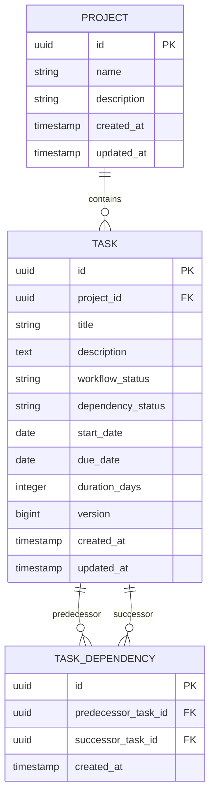
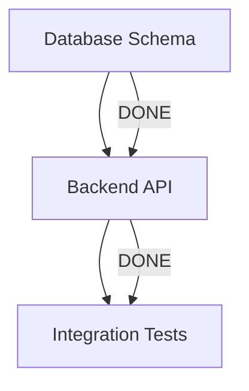
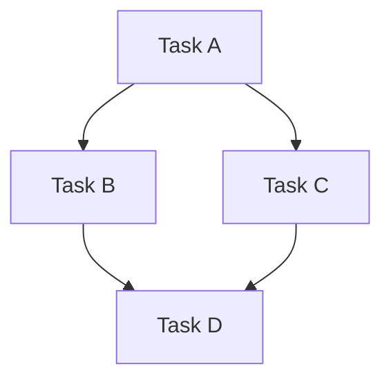

# TaskFlow Pro

A dependency-aware workflow and DAG scheduling platform engineered around a deterministic graph engine.

## Overview

TaskFlow Pro is designed to manage complex task workflows where task execution readiness and schedules depend strictly on directed acyclic graph (DAG) relationships. 

The core architectural invariant of the system is:

> **The deterministic DAG/dependency engine is the source of truth.**  
> The frontend never decides whether a dependency is valid, whether a task is Ready or Blocked, or how dates propagate downstream. The backend domain layer owns and validates all dependency rules.

## Architecture

TaskFlow Pro is structured as a modular monolith:

```text
                    TaskFlow Pro
                         |
              ┌──────────┴──────────┐
              |                     |
          Kanban UI            DAG Engine
                                    |
                         ┌──────────┼──────────┐
                         |          |          |
                    Dependency   Readiness  Scheduling
                    Validation   Engine      Engine
```

- **Frontend (`/frontend`)**: Next.js 14, React, TypeScript, and Tailwind CSS. Focuses purely on visual state representation, user interaction, and dispatching commands to the backend.
- **Backend (`/backend`)**: Java 21, Spring Boot 3, and Spring Data JPA. Organized in domain-oriented packages (`common`, `project`, `task`, `dependency`, `scheduling`, `criticalpath`, `ai`).
- **Database (`docker-compose.yml`)**: PostgreSQL 16 containerized with Flyway schema migration management.

## Domain Model

TaskFlow Pro organizes work in projects, tasks, and directed dependency edges:

```text
Project
   |
   └── Tasks
          |
          └── Task Dependencies
                  |
                  └── predecessor → successor
```

### Invariant & Status Separation

A fundamental rule of TaskFlow Pro is separating user workflow progression from topological readiness:

```text
Workflow Status (User-controlled column placement)
--------------------------------------------------
BACKLOG
IN_PROGRESS
REVIEW
DONE

Dependency Status (System-derived readiness state)
--------------------------------------------------
READY
BLOCKED
```

> **Important**: Dependency status (`READY` / `BLOCKED`) is strictly **derived from prerequisite task completion in the DAG**. It is not a user-controlled Kanban status. A task can be `IN_PROGRESS + BLOCKED` or `BACKLOG + READY`.

### Entity-Relationship Diagram



## Dependency Graph Engine (DAG)

The DAG engine is the deterministic source of truth for graph topology. It is decoupled from Spring Data, web controllers, React, and scheduling math.

### In-Memory Graph Representation
- **Isolation**: When evaluating or traversing dependencies, the relevant project subgraph is loaded into memory in a single query (`DependencyGraphBuilder`), preventing N+1 database queries.
- **Node & Edge Indexes**: Maintained as `Map<UUID, Set<UUID>>` for both outgoing (`successors`) and incoming (`predecessors`) edges, enabling $O(1)$ adjacency lookups.
- **Immutability & Safety**: Collections returned from the graph are defensive, unmodifiable copies.

### Algorithms & Complexity

#### 1. Cycle Detection ($O(V + E)$)
- **Full Graph Inspection**: Implemented via depth-first search (DFS) with a three-color state machine (`UNVISITED`, `VISITING`, `VISITED`). Encountering a node currently in the `VISITING` state identifies a directed back-edge, confirming a cycle.
- **Targeted Edge Pre-Validation**: Before creating edge $A \rightarrow B$, the engine evaluates if $B$ can already reach $A$ via graph traversal. If reachable, adding $A \rightarrow B$ is rejected with `CycleDetectedException` before database writes occur, ensuring transactional integrity.

#### 2. Topological Sorting ($O(V + E)$)
- **Kahn's Algorithm**: Nodes with zero in-degree are processed iteratively while decrementing successor in-degrees.
- **Deterministic Tie-Breaking**: When multiple nodes have zero in-degree simultaneously, a priority queue resolves ties via standard natural UUID lexical order. Identical graphs produce identical, deterministic execution orders every time.
- **Cycle Guard**: If the processed node count is less than the total node count, Kahn's algorithm confirms a cycle and aborts.

#### 3. Traversal ($O(V + E)$)
- **Descendant Traversal**: Traverses all downstream nodes using BFS, ensuring converging dependencies (e.g. $A \rightarrow B \rightarrow D$ and $A \rightarrow C \rightarrow D$) include shared successor $D$ exactly once without duplicate processing.
- **Ancestor Traversal**: Traverses upstream prerequisites via incoming edges.
- **Affected Subgraph**: Produces the set of all downstream tasks affected by a change, ordered in topological sequence for schedule recalculation.

## Dependency Readiness

TaskFlow Pro strictly separates user workflow progression from topological execution readiness:

- **Workflow status is user-controlled** (`BACKLOG`, `IN_PROGRESS`, `REVIEW`, `DONE`): Users freely move tasks across Kanban columns.
- **Dependency status is server-derived** (`READY`, `BLOCKED`): Derived purely by the backend engine from the workflow completion of prerequisite tasks. Clients cannot manually set dependency status.

### Authoritative Readiness Rules

For any task $T$, let $P(T)$ be its set of direct prerequisites/predecessors:

1. **`READY`**:
   - $P(T)$ is empty (the task has no prerequisites), **OR**
   - Every predecessor in $P(T)$ has `workflowStatus == DONE` and is itself satisfied (`READY`).
2. **`BLOCKED`**:
   - At least one predecessor in $P(T)$ has `workflowStatus != DONE` or is itself `BLOCKED`.

> **Invariant**: Readiness is never derived from predecessor `dependencyStatus` in isolation. It authoritative requires that all prerequisites have achieved `workflowStatus == DONE`.

### Flow of Readiness Through the Graph



1. **Initial State**:
   - $A$: `workflowStatus = IN_PROGRESS`, `dependencyStatus = READY` (no prerequisites)
   - $B$: `workflowStatus = BACKLOG`, `dependencyStatus = BLOCKED` (waiting on $A$)
   - $C$: `workflowStatus = BACKLOG`, `dependencyStatus = BLOCKED` (waiting on $B$)
2. **Upstream Completion**:
   - When $A$ transitions to `DONE`, the readiness engine locates $A$'s affected descendants ($[B, C]$) and evaluates them in strict **topological order**.
   - $B$'s prerequisites are now satisfied $\rightarrow B$ transitions to `READY`.
   - $C$'s prerequisite $B$ is not yet `DONE` $\rightarrow C$ remains `BLOCKED`.
3. **Multi-Level Unlock**:
   - When $B$ transitions to `DONE`, $C$'s prerequisites are satisfied $\rightarrow C$ transitions to `READY`.
4. **Downstream Rollback**:
   - If $A$ is reopened (`DONE -> IN_PROGRESS`), the engine traverses the affected subgraph in topological order.
   - $B$ is recalculated to `BLOCKED`.
   - Because $B$'s prerequisite chain is broken, $C$ is immediately recalculated to `BLOCKED`.
   - Rollback propagates throughout the entire downstream graph—preventing stale `READY` states.
5. **Converging Dependencies & Idempotency**:
   - Converging successors (e.g. $B \rightarrow D, C \rightarrow D$) are evaluated exactly once in topological order.
   - Only tasks whose `dependencyStatus` actually changes are updated and persisted, preventing database write churn and unnecessary optimistic-lock version increments.

## Scheduling Engine

TaskFlow Pro implements a deterministic, constraint-based scheduling engine that automatically propagates upstream date changes downstream through the DAG without compounding delays.

### Date Semantics & Model

1. **`plannedStartDate`**: The user's independent planned schedule baseline.
2. **`durationDays`**: Number of inclusive calendar days occupied by the task ($durationDays \ge 1$). Duration is strictly preserved across all shifts.
3. **`scheduledStartDate`**: The effective start date after applying all prerequisite dependency constraints.
4. **`scheduledDueDate`**: The effective completion date calculated as:
   $$\text{scheduledDueDate} = \text{scheduledStartDate} + \text{durationDays} - 1\text{ day}$$

### The Scheduling Invariant

For every directed dependency $P \rightarrow S$ ($P$ is predecessor, $S$ is successor):

$$\text{successor.scheduledStartDate} \ge \max_{P \in \text{predecessors}} (P.\text{scheduledDueDate} + 1\text{ day})$$

$$\text{successor.scheduledStartDate} \ge \text{successor.plannedStartDate}$$

$$\text{successor.scheduledDueDate} = \text{successor.scheduledStartDate} + \text{successor.durationDays} - 1\text{ day}$$

### Why Delays Do Not Compound (Converging Paths)

In a diamond / converging dependency graph:



Suppose task $A$ is delayed by $+3$ days:
- Both $B$ and $C$ depend directly on $A$, so their scheduled dates shift by $+3$ days.
- Successor $D$ depends on both $B$ and $C$.
- Rather than summing delays ($+3$ from $B$ and $+3$ from $C = +6$), the engine computes the constraint:
  $$D.\text{scheduledStartDate} = \max(D.\text{plannedStartDate}, B.\text{scheduledDueDate} + 1, C.\text{scheduledDueDate} + 1)$$
- Since both $B$ and $C$ finish on the same shifted date, $\max(B.\text{due} + 1, C.\text{due} + 1)$ shifts $D$ by **exactly $+3$ days**, completely preventing compound delay accumulation.

### Baseline Recomputability

Because schedules are derived from:
$$\text{plannedStartDate} + \text{current dependency constraints}$$
if an upstream task $A$ is moved earlier, downstream successors can return to their independent baseline planned schedule without relying on historical delta records or accumulated state drift.

## Dependency Impact Preview

TaskFlow Pro provides a high-fidelity **Dependency Impact Preview** capability. Before committing a task schedule mutation, clients can query the system to evaluate the exact downstream schedule consequences:

> *"If I make this proposed schedule change, which downstream tasks will be affected, what will their new scheduled dates be, and why?"*

### Conceptual Architecture & Execution Flow

```text
               Proposed date
                     ↓
            Affected descendants (DAG)
                     ↓
             Topological ordering
                     ↓
         In-memory schedule simulation
       (Shared ScheduleCalculationService)
                     ↓
          Compare current vs proposed
                     ↓
     Explain constraints & binding predecessors
                     ↓
               Return preview
```

### Core Architectural Guarantees

1. **Side-Effect Free Simulation**:
   - The preview endpoint (`POST /api/tasks/{taskId}/schedule/preview`) executes with `@Transactional(readOnly = true)`.
   - Never writes to the database, never modifies JPA entities, never mutates `updatedAt`, never increments `@Version`, and publishes zero domain events.
   - All evaluations occur in memory on lightweight simulation projections. The preview can be called repeatedly and safely in real-time as a user drags dates or types input.

2. **Single Source of Truth (Zero Calculation Drift)**:
   - Preview and actual mutation (`PUT /api/tasks/{id}`) invoke the **exact same deterministic engine**: `ScheduleCalculationService`.
   - The preview exactly predicts the committed database state, eliminating discrepancies where a preview promises one date but commit produces another.

3. **Descendant Discovery & Project Graph Scope**:
   - Uses the DAG traversal engine to extract the `AffectedSubgraph` for the source task.
   - Unrelated components (e.g. $X \rightarrow Y \rightarrow Z$ when modifying $A \rightarrow B \rightarrow C$) are excluded from recalculation and response payloads.
   - Single-batch loading (`findByProjectId`) fetches tasks efficiently in $O(V + E)$ without $N+1$ database roundtrips.

4. **Converging Path Non-Compounding Evaluation**:
   - In diamond graphs ($A \rightarrow B \rightarrow D$, $A \rightarrow C \rightarrow D$), shifting $A$ by $+3$ days shifts $B$ by $+3$ days, $C$ by $+3$ days, and $D$ by $+3$ days.
   - The engine computes $\max(B.\text{due} + 1, C.\text{due} + 1)$ rather than adding delays together ($+3 + 3 = +6$).

5. **Binding Predecessor Identification**:
   - Successors determine their earliest allowed start from the maximum required start across all direct predecessors:
     $$\text{latestConstraint} = \max_{P \in \text{predecessors}} (P.\text{scheduledDueDate} + 1\text{ day})$$
   - Every predecessor $P$ where $P.\text{scheduledDueDate} + 1 == \text{latestConstraint}$ is identified as a **binding predecessor** (`constraintSourceTaskIds`).
   - If multiple predecessors finish on the same maximum date, all binding predecessors are reported.

6. **Baseline vs. Constraint Disambiguation**:
   - If a successor's independent `plannedStartDate` is later than or equal to the dependency constraint date, the task is classified as `PLANNED_DATE_DOMINANT`.
   - The preview clearly explains that the task's schedule is unchanged because its planned schedule is already later than the dependency requirement, rather than falsely claiming a dependency delay.

## Technology Stack

### Backend
- **Language**: Java 21
- **Framework**: Spring Boot 3.3.4 (Spring Web, Spring Data JPA, Bean Validation)
- **Database Migrations**: Flyway
- **Driver**: PostgreSQL JDBC
- **Testing**: JUnit 5, Mockito, AssertJ, H2 (test profile)

### Frontend
- **Framework**: Next.js 14 (App Router)
- **Language**: TypeScript (strict mode)
- **Styling**: Tailwind CSS (custom semantic state system)
- **Icons / UI**: Custom minimal atoms (`Badge`, `Button`, `Card`)

### Infrastructure
- **Containerization**: Docker & Docker Compose
- **Database**: PostgreSQL 16 Alpine

## Repository Structure

```text
taskflow-pro/
├── backend/
│   ├── src/
│   │   ├── main/
│   │   │   ├── java/
│   │   │   │   └── com/taskflow/taskflow/
│   │   │   │       ├── TaskFlowApplication.java
│   │   │   │       ├── common/                 # Configs, exception handling, error response contracts
│   │   │   │       ├── task/                   # Task module foundation
│   │   │   │       ├── dependency/             # Dependency module foundation
│   │   │   │       ├── scheduling/             # Scheduling module foundation
│   │   │   │       ├── criticalpath/           # Critical path module foundation
│   │   │   │       └── ai/                     # AI suggestions module foundation
│   │   │   └── resources/
│   │   │       ├── db/migration/
│   │   │       │   └── V1__init.sql            # Flyway baseline migration
│   │   │       └── application.yml             # Spring configuration with env substitution
│   │   └── test/
│   │       ├── java/                           # Unit and integration test suites
│   │       └── resources/
│   │           └── application-test.yml        # Test configuration
│   ├── pom.xml
│   └── README.md
│
├── frontend/
│   ├── app/                                    # Next.js App Router layout and pages
│   ├── components/
│   │   ├── ui/                                 # Reusable UI atoms (Badge, Button, Card)
│   │   └── layout/                             # Header and Sidebar shell
│   ├── hooks/                                  # React hooks
│   ├── lib/
│   │   ├── api/                                # Typed API client and task API service
│   │   └── utils/                              # Utility helpers (cn)
│   ├── types/                                  # TypeScript domain interfaces
│   ├── public/                                 # Static assets
│   ├── package.json
│   ├── tsconfig.json
│   └── README.md
│
├── docker-compose.yml                          # PostgreSQL container setup
├── .env.example                                # Template for local environment variables
├── .gitignore                                  # Git exclusion rules
└── README.md                                   # Root documentation
```

## Local Development

### 1. Prerequisites
- Java 21+
- Node.js 20+ and npm 10+
- Docker & Docker Compose

### 2. Configure Environment
Copy the sample environment variables:
```bash
cp .env.example .env
```

### 3. Start Database
```bash
docker compose up -d postgres
```
Verify the container status:
```bash
docker compose ps
```

### 4. Run Backend
```bash
cd backend
./mvnw spring-boot:run
```
The backend server runs on `http://localhost:8080`.

### 5. Run Frontend
```bash
cd frontend
npm install
npm run dev
```
The frontend application runs on `http://localhost:3000`.

## Backend

The backend enforces single-responsibility architecture across domain boundaries:
- **`common`**: Global exception hierarchy (`ApiException`, `ResourceNotFoundException`, `DomainException`, `ValidationException`), structured JSON response format (`ErrorResponse`), and CORS configuration.
- **`task`**: Task entities, lifecycle state transitions, and task CRUD (Phase 2).
- **`dependency`**: Graph validation, cycle detection, edge management, and Ready/Blocked readiness calculation (Phase 2+).
- **`scheduling`**: Downstream date propagation and non-compounding schedule shift calculation (Phase 3).
- **`criticalpath`**: Longest dependency path and float/slack calculation (Phase 4).
- **`ai`**: Dependency suggestion generation and human approval flow (Phase 5).

## Frontend

The frontend adopts a dark, minimal, professional aesthetic with zero uncontrolled `any` types. All API requests are encapsulated in dedicated service modules (`lib/api/*`) rather than making ad-hoc fetch calls inside React components.

Semantic state styling conveys workflow states:
- **Ready**: Emerald green badge / border indicating predecessor tasks are satisfied.
- **Blocked**: Rose red badge / border indicating predecessor tasks are pending.
- **Warning**: Amber badge for scheduling conflicts or impending deadline issues.
- **Neutral**: Zinc badge for backlog or unscheduled items.

## Database

PostgreSQL 16 is managed using Flyway migrations located in `backend/src/main/resources/db/migration/`.
- `V1__init.sql`: Sets up the initial database schema baseline.
- Future schema migrations (`V2__...`, `V3__...`) will introduce task and dependency tables in upcoming phases.

## Environment Variables

Defined in `.env.example`:

| Variable | Description | Default |
|---|---|---|
| `POSTGRES_DB` | PostgreSQL database name | `taskflow` |
| `POSTGRES_USER` | PostgreSQL user | `taskflow` |
| `POSTGRES_PASSWORD` | PostgreSQL password | `change_me` |
| `POSTGRES_PORT` | PostgreSQL host port | `5432` |
| `POSTGRES_HOST` | PostgreSQL host | `localhost` |
| `SERVER_PORT` | Backend application port | `8080` |
| `SPRING_PROFILES_ACTIVE` | Active Spring profile | `dev` |
| `NEXT_PUBLIC_API_URL` | Frontend API target | `http://localhost:8080/api` |

## Testing

### Backend Tests
Runs both context initialization, structured exception handler verification, and database integration:
```bash
cd backend
./mvnw test
```

### Frontend Build & Lint Verification
```bash
cd frontend
npm run lint
npm run build
```

## Future Modules

### Implemented (Phases 1 - 6)
- [x] **Phase 1**: Monorepo foundation, Spring Boot 3 modular monolith (Java 21), Next.js 14 shell, Docker Compose PostgreSQL 16, Flyway baseline, centralized error handling.
- [x] **Phase 2**: Core domain model (`Project`, `Task`, `TaskDependency`), PostgreSQL relational schema via Flyway (`V2__create_core_domain_tables.sql`), optimistic locking, project isolation validation, and persistence test suite.
- [x] **Phase 3**: Deterministic DAG Engine (`DependencyGraph`, DFS cycle detection, Kahn's topological sort with deterministic tie-breaking, reachability, descendant/ancestor traversal, affected subgraph calculation, and transactional cycle prevention).
- [x] **Phase 4**: Dependency Readiness Engine (evaluating prerequisite completion, derived `READY`/`BLOCKED` status propagation in topological order, multi-level unlock, downstream rollback on task reopen, converging graph handling, and edge addition/removal recalculation).
- [x] **Phase 5**: Dependency-Aware Scheduling Engine (constraint-based schedule calculation, non-compounding downstream date propagation, topological schedule recalculation, duration preservation, recomputable baseline schedules, and transactional persistence).
- [x] **Phase 6**: Dependency Impact Preview (side-effect-free in-memory schedule simulation, identical calculation engine reuse, binding predecessor identification, converging path non-compounding explanation, preview/commit consistency verification, and REST preview API).

### Planned (Upcoming Phases)
- [ ] **Phase 7**: Interactive four-column Kanban board with `dnd-kit`, critical path analysis, and human-in-the-loop AI dependency suggestions
